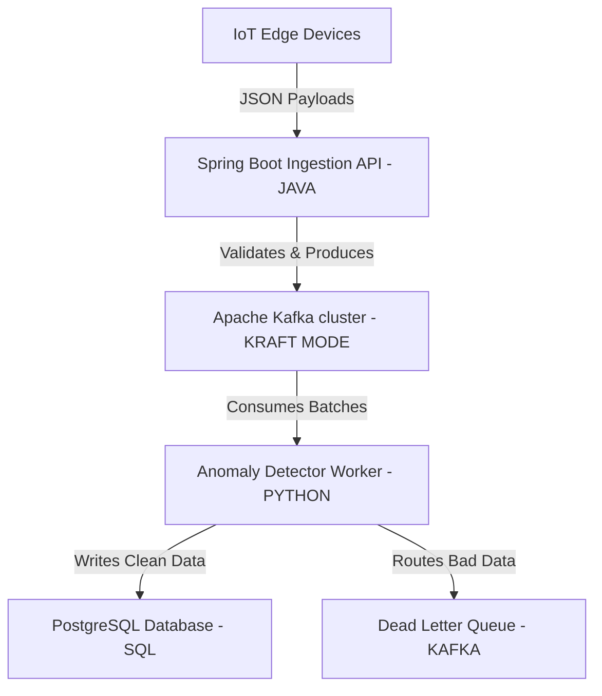

# ⚡ EventPulse: Distributed Telemetry & Anomaly Pipeline


## 📌 Overview
**EventPulse** is a decoupled, high-throughput streaming architecture designed to ingest, buffer, and analyze massive volumes of IoT edge telemetry. 

Built to demonstrate enterprise-grade distributed systems patterns, this project handles asynchronous ingestion via Java, guarantees message delivery via Kafka, and processes CPU-bound anomaly detection via Python.

## 🏗️ System Architecture



### 1. Ingestion Layer (Java 17 / Spring Boot)
- **Role:** High-availability REST API acting as the system's entry point.
- **Mechanics:** Receives JSON payloads, validates schemas, and utilizes `KafkaTemplate` to produce messages asynchronously.
- **Key Concepts:** `@Transactional` boundaries, JVM Garbage Collection tuning (G1GC), and ThreadPool optimization.

### 2. Message Broker (Apache Kafka)
- **Role:** Fault-tolerant buffer separating ingestion from processing.
- **Mechanics:** Runs in modern **KRaft mode** (no Zookeeper). Implements partitioned topics for parallel processing.
- **Key Concepts:** Exactly-Once Semantics (EOS), `acks=all`, consumer group rebalancing, and Dead Letter Queues (DLQ).

### 3. Processing Layer (Python 3)
- **Role:** Asynchronous worker evaluating CPU-bound anomaly detection.
- **Mechanics:** Consumes Kafka message batches via generators.
- **Key Concepts:** Bypassing the Python GIL via multiprocessing, manual offset commits, and lazy evaluation of data streams.

### 4. Persistence & Analytics (PostgreSQL)
- **Role:** Time-series storage for processed telemetry.
- **Mechanics:** Relational schema optimized with composite B-Tree indexes.
- **Key Concepts:** Advanced SQL Window Functions (`RANK`, `ROW_NUMBER`) for calculating moving averages and latency spikes.

---

## 🚀 How to Run Locally

### 1. Boot the Infrastructure
Ensure Docker is installed. Spin up Kafka, Kafka-UI, and PostgreSQL:
```bash
cd eventpulse
docker-compose up -d
```
*Kafka UI will be available at `http://localhost:8080`*

### 2. Start the Ingestion API
```bash
cd ingestion-api
./mvnw spring-boot:run
```

### 3. Start the Anomaly Worker
```bash
cd anomaly-worker
pip install -r requirements.txt
python consumer.py
```
